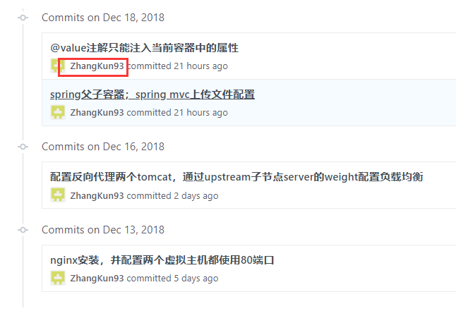

最近新建了一个notes仓库，准备以后用来记录学习笔记。提交了几次，今天打开notes仓库，查看commits历史，发现用户为ZhangKun93，不是我当前用户名，如图：
  
另外，查看contributors，用户也是ZhangKun93，点击这个用户名，发现跳转到另一个用户的github了。   
经过查询资料以及很多次尝试，才发现原来github这里显示的用户名是提交者本地配置的邮箱注册的github账号的用户名。    
所以在本地的git终端修改邮箱即可。  
git config --global user.name bkunzhang  
git config --global user.email xxx  
